# Installing MySQL and MySQL Workbench on Ubuntu

## Install MySQL
Open the terminal and type the following commands:

```bash
sudo apt update
```

```bash
sudo apt install mysql-server
```

Check if you can see the version.

```bash
mysql --version
```
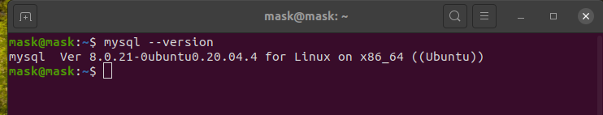

<br>

Now, we have to run another command.

```bash
sudo mysql_secure_installation
```

Press <span style="color:#f03c15">**y**</span>

<br>

It will ask you to provide a level of password validation policy. I have typed **0** (zero) because it is just a test. Normally, you should have at least a medium level.

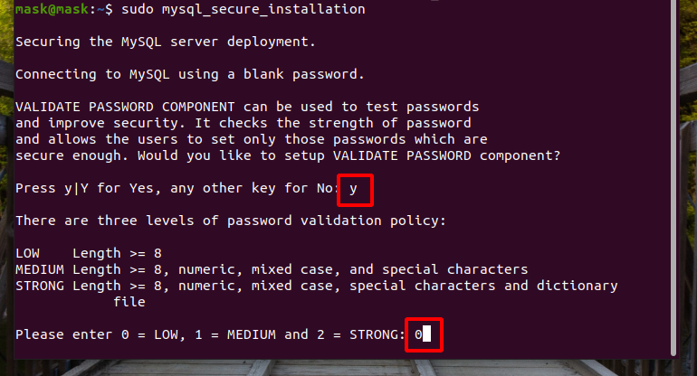

<br>

After you press enter, you will be asked a few questions. 

The following image shows my selections. **The selections depend on what you want**.

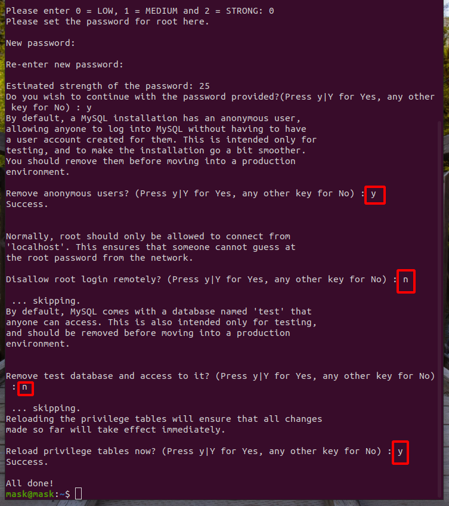

<br>

Now, you can access MySQL by running the command:


```bash
sudo mysql
```

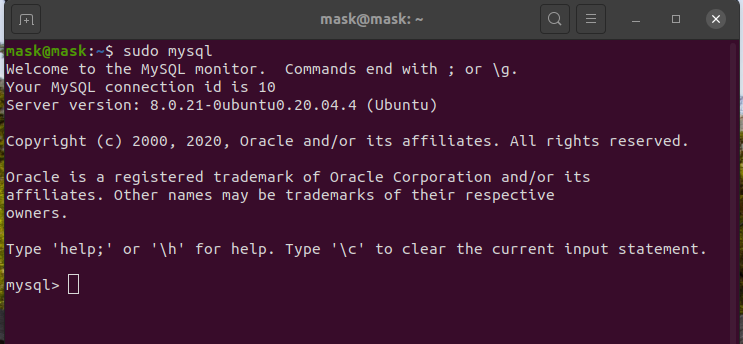

As you can see no password was asked to access MySQL as root user.

Thus, we have to <span style="color:#f03c15">modify the authentication mechanism</span>. Let's see the root users in order to check the plugin for authentication.

```sql
select user, authentication_string, plugin from mysql.user;
```

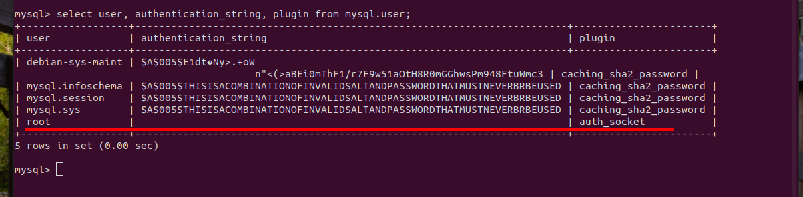

The root's plugin is auth_socket and we have to <span style="color:#f03c15">change it to mysql_native_password</span>.

```sql
ALTER USER 'root'@'localhost' IDENTIFIED WITH mysql_native_password by 'ainigma100';
```

<br>

With the above command we are setting the password of the root user. I set the password <span style="color:#f03c15">**ainigma100**</span> for the <span style="color:#f03c15">root user</span>.

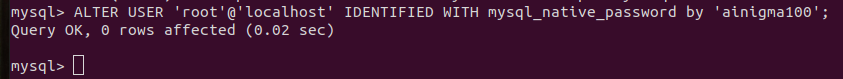

<br>

If you run again this command, you can verify that the root plugin changed into <span style="color:#f03c15"> mysql_native_password</span>

```sql
select user, authentication_string, plugin from mysql.user;
```

<br>

Now, run this command to take the changes effective immediately.

```sql
FLUSH PRIVILEGES;
```
<br>

Exit MySQL by typing **exit**. Now try to access MySQL as a root user by typing: 

```bash
sudo mysql -u root -p
```
 The first time you do this, it might first ask you the password for Ubuntu and the ask you the password for MySQL root user.

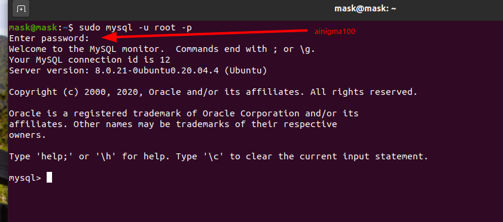

<br>

You can view the databases with the following command:

```sql
show databases;
```

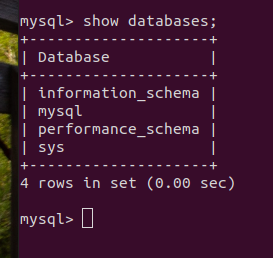

<br>

We can also check the root users by typing:

```sql
select Host, User from mysql.user;
```

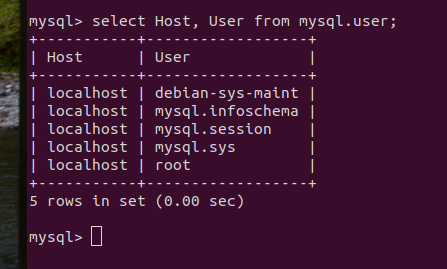

<br>

## Create New User
We are going to create a new user and provide all the privileges like the root user.

```sql
CREATE USER 'ainigma'@'localhost' IDENTIFIED BY 'ainigma100';
```

The above command will create a <span style="color:#f03c15">new user</span> called <span style="color:#f03c15">ainigma</span> with <span style="color:#f03c15">password ainigma100</span>.

Run this command to check if the ainigma user was added.

```sql
select Host, User from mysql.user;
```


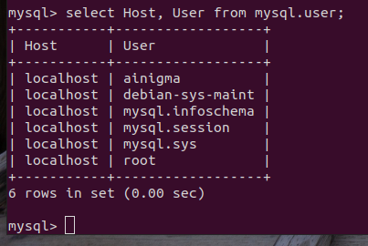

<br>

Now that we created a new user, we can grant all the privileges in order to make him a superuser.


```sql
GRANT ALL ON *.* TO 'ainigma'@'localhost' WITH GRANT OPTION;
```

The <span style="color:#f03c15">*</span> (asterisk) symbols are used as wildcards.

\*.\* means: <span style="color:#f03c15">**all-databases**</span>.<span style="color:#f03c15">**all-tables**</span>

and flush the privileges.


```sql
FLUSH PRIVILEGES;
```
<br>

## Download and Install MySQL Workbench

I downloaded [MySQL Workbench](https://dev.mysql.com/downloads/workbench/) manually and not from Ubuntu Software.

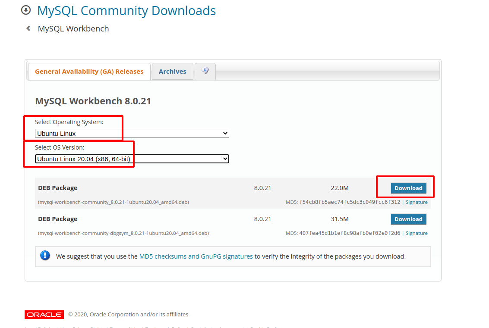

<br>

After you press download you will see the following window:

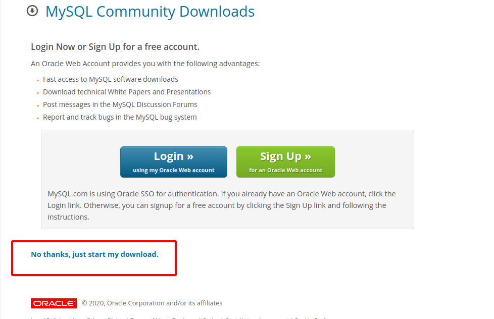

Just press the link <span style="color:#f03c15">**"No thanks, just start my download."**</span>

<br>

Go to the location you have downloaded the file and install it!

Enjoy!!! :wink:
